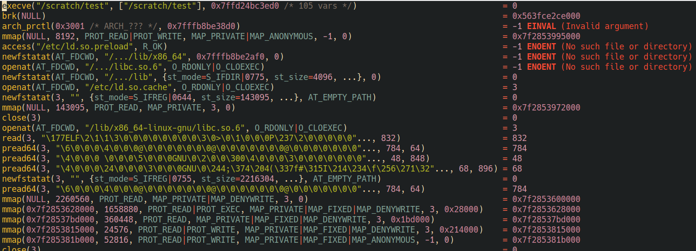

## Major mode for strace

There are two modes defined, one using tree-sitter and one without. They provide
font-locking and a couple commands for alignment and help at point.

The tree-sitter mode requires the grammar to be installed from
https://github.com/sigmaSd/tree-sitter-strace.

Example using `strace-ts-mode`

